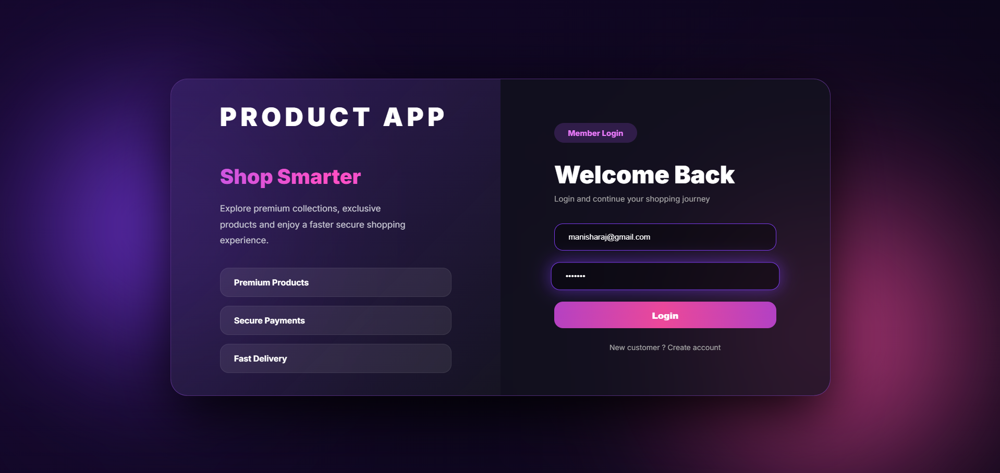
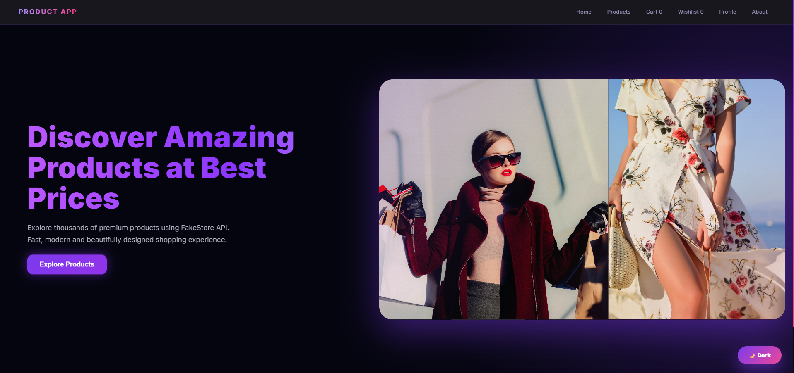
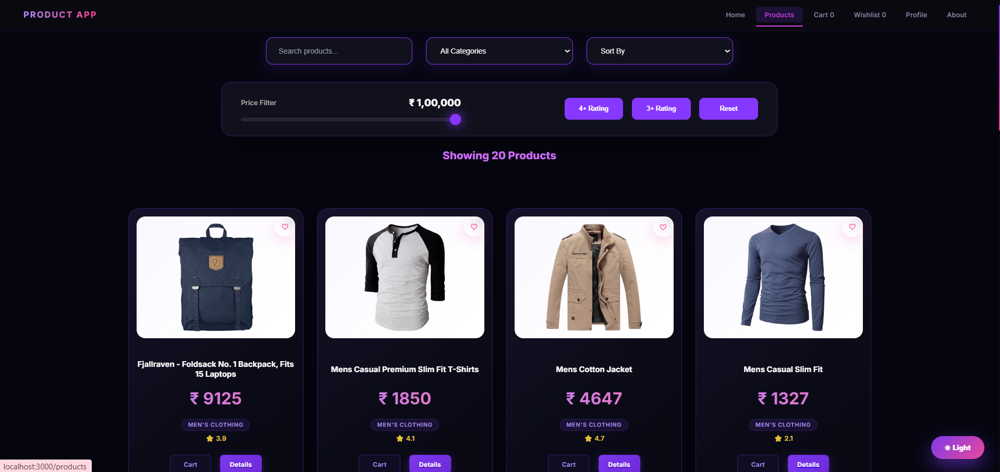
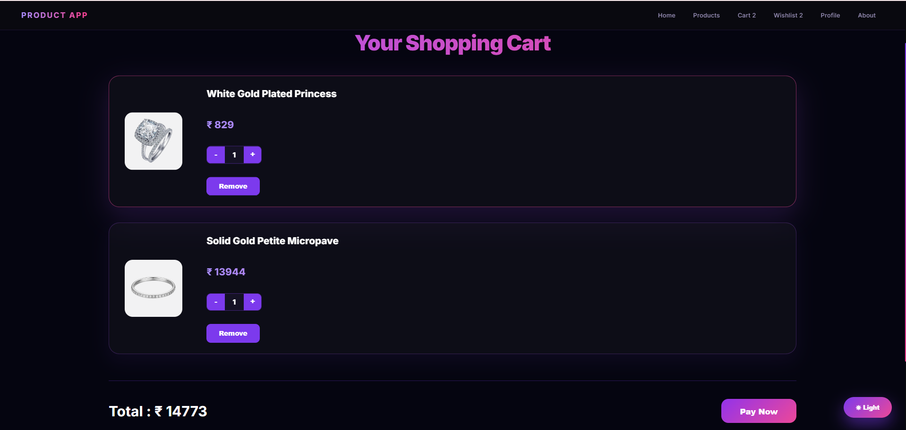
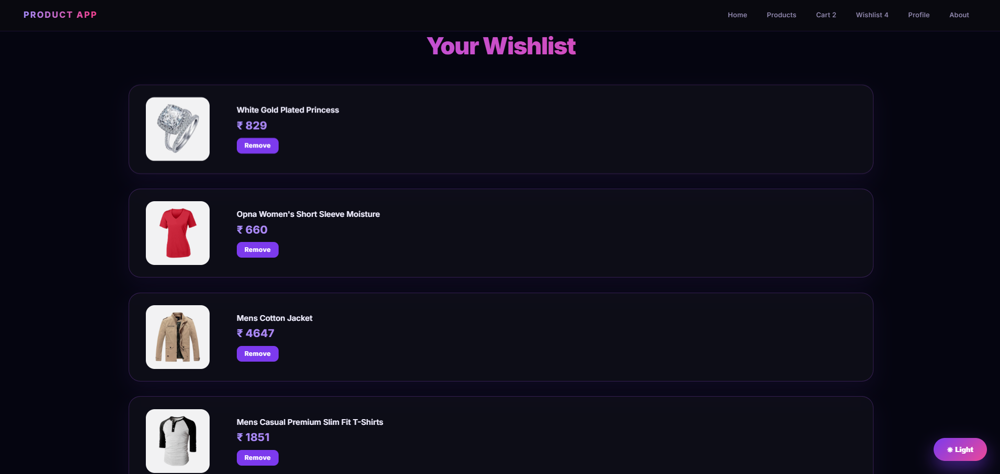

#  Product App - React E-Commerce Web Application

##  Project Overview

Product App is a modern and responsive **E-Commerce web application** developed using **React.js**.  
The application provides a smooth online shopping experience where users can browse products, view detailed product information, manage their shopping cart, and maintain a wishlist.

The project uses **FakeStore API** for fetching real-time product data and demonstrates important React concepts such as component-based architecture, API integration, routing, state management, and reusable UI components.


---

#  Live Features

##  User Authentication

- User Login functionality
- Login form validation
- Protected page access
- Authentication state handling
- Stores login status using Browser Local Storage
- Redirects users based on login status


---

##  Home Page

The Home page contains:

- Modern landing page design
- Attractive hero section
- Product introduction banner
- Call-to-action button
- Responsive layout


---

##  Products Page

Users can:

- View all available products
- Browse product collections
- See product images
- View product name and price
- Access detailed product information


Products are dynamically loaded from:

```
FakeStore API
```

---

##  Product Details Page

Displays complete information about a selected product:

- Product image
- Product title
- Description
- Price
- Category details
- Add to cart option
- Wishlist option


---

##  Shopping Cart

Cart functionality includes:

- Add products to cart
- Prevent duplicate products
- View selected products
- Remove products from cart
- Cart count update in Navbar


---

##  Wishlist Management

Wishlist features:

- Save favorite products
- Avoid duplicate wishlist items
- View wishlist products
- Remove wishlist items
- Wishlist counter update


---

## 👤 Profile Page

User profile section includes:

- User information display
- Account section design
- Clean profile interface


---

##  Toast Notification System

Implemented custom notifications for:

- Product added successfully
- Duplicate cart item warning
- Wishlist updates
- User actions


---

#  Technologies Used


## Frontend

- React.js
- JavaScript
- HTML5
- CSS3


## React Concepts

- React Components
- React Hooks
- useState Hook
- Props Handling
- Conditional Rendering
- State Management


## Libraries

- React Router DOM
- Axios


## API

- FakeStore API


## Storage

- Browser Local Storage


---

#  Project Folder Structure


```
product-app

│
├── public
│
├── src
│   │
│   ├── components
│   │
│   ├── About.js
│   ├── Cart.js
│   ├── Footer.js
│   ├── Header.js
│   ├── Home.js
│   ├── Login.js
│   ├── Navbar.js
│   ├── ProductDetails.js
│   ├── Products.js
│   ├── Profile.js
│   ├── Wishlist.js
│
│
├── App.js
├── App.css
├── index.js
│
├── package.json
└── README.md

```


---

#  Installation and Setup

## 1. Clone Repository

```bash
git clone https://github.com/your-username/product-app.git
```


## 2. Move into Project Folder

```bash
cd product-app
```


## 3. Install Dependencies

```bash
npm install
```


## 4. Install Required Packages

React Router:

```bash
npm install react-router-dom
```

Axios:

```bash
npm install axios
```


## 5. Run Application

```bash
npm start
```


Application runs on:

```
http://localhost:3000
```


---

#  API Integration

This project uses FakeStore API.

API Endpoint:

```
https://fakestoreapi.com/products
```

Used for:

- Fetching products
- Product images
- Product prices
- Product descriptions
- Categories


---

# Main Components Explanation


## App.js

Main component responsible for:

- Application state
- Cart management
- Wishlist management
- Login status
- Toast notifications


---

## Header.js

Handles:

- React Router configuration
- Page navigation
- Protected routes


---

## Navbar.js

Contains:

- Navigation links
- Cart count
- Wishlist count
- User navigation


---

## Products.js

Responsible for:

- API fetching
- Displaying products
- Product actions


---

## Login.js

Handles:

- User login form
- Validation
- Authentication updates


---

#  Responsive Design

The application supports:

- Desktop screens
- Tablet screens
- Mobile screens

Implemented using:

- CSS Flexbox
- Responsive layouts

---

# 📸 Screenshots


## 🔐 Login Page




## 🏠 Home Page




## 🛍️ Products Page




## 🛒 Cart Page




## ❤️ Wishlist Page



---
#  Future Enhancements

Upcoming improvements:

- User Registration System
- Backend API Integration
- Database Storage
- Admin Dashboard
- Product Upload System
- Order Management
- Payment Gateway Integration
- Product Reviews
- User Authentication using JWT


---

#  Learning Outcomes

Through this project:

- Created React components
- Managed application state
- Integrated external API
- Implemented routing
- Managed user interactions
- Built responsive UI
- Used reusable components
- Implemented cart and wishlist logic


--

 Thank you for visiting this project!
